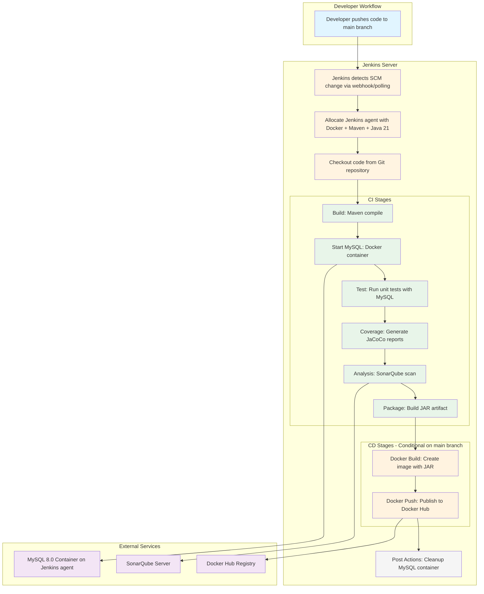

# Design Document: Complete CI/CD Pipeline

## Overview

This design document specifies the technical architecture for implementing a complete CI/CD pipeline for the competence-backend1 Spring Boot microservice using **Jenkins**. The solution enhances the existing CI pipeline with code quality analysis (SonarQube) and coverage reporting (JaCoCo), implements a CD pipeline for automated Docker image deployment to Docker Hub, and orchestrates the entire workflow in a single Jenkins declarative pipeline with sequential stage execution.

The Jenkins pipeline uses declarative syntax defined in a Jenkinsfile, with stages for build, test, coverage analysis, SonarQube scanning, packaging, Docker image creation, and Docker Hub publication. All stages execute sequentially on Jenkins agents with Docker, Maven, and Java 21 capabilities.

### System Context

The competence-backend1 application is a Spring Boot 3.2.0 microservice built with Java 21, using Maven as the build tool and MySQL 8.0 for data persistence. The current CI pipeline successfully executes unit tests with MySQL integration but lacks code quality analysis, coverage reporting, and automated deployment capabilities.

### Design Goals

1. **Code Quality Assurance**: Integrate SonarQube static analysis to detect code smells, bugs, vulnerabilities, and technical debt
2. **Coverage Visibility**: Implement JaCoCo code coverage measurement and reporting integrated with SonarQube
3. **Automated Deployment**: Create CD stages that build and publish Docker images to Docker Hub
4. **Pipeline Orchestration**: Implement sequential stage execution in a single Jenkinsfile where CD stages execute automatically after successful CI stages
5. **Configuration Correctness**: Ensure pom.xml contains proper JaCoCo and SonarQube plugin configurations
6. **Security**: Manage sensitive credentials (SonarQube token, Docker Hub credentials) using Jenkins Credentials store

### Key Technical Decisions

**Jenkins Declarative Pipeline**: The design uses Jenkins declarative pipeline syntax for clarity, maintainability, and built-in support for stage visualization. All CI and CD stages are defined in a single Jenkinsfile with sequential execution. The pipeline runs on Jenkins agents configured with Docker, Maven, and Java 21 tools.

**Jenkins Agent Configuration**: The pipeline requires Jenkins agents with Docker daemon access, Maven 3.9+, and Java 21 JDK. Agents can be configured as Docker-based agents or traditional VM/bare-metal agents with required tools installed.

**Maven POM Configuration**: The pom.xml includes JaCoCo plugin (version 0.8.11) with prepare-agent and report goals, and SonarQube properties for project configuration. All plugin configurations are consolidated under a single `<build>` element.

**Lombok Coverage Exclusion**: Lombok-generated code (getters, setters, constructors) inflates coverage metrics without adding value. The design uses a `lombok.config` file to instruct Lombok to add `@lombok.Generated` annotations, which JaCoCo automatically excludes from coverage analysis.

**Pipeline Orchestration**: Sequential stage execution within a single Jenkinsfile ensures CD stages execute only after successful CI completion. Conditional `when` directives control CD stage execution based on branch (main only) and previous stage success. Unlike GitHub Actions which uses separate workflow files and workflow_run triggers, Jenkins uses a single pipeline with stage-level conditionals.

**Artifact Management**: The Jenkins pipeline uses stash/unstash mechanism to preserve the JAR artifact between stages, ensuring the same artifact built during CI is used for Docker image creation in CD stages. This replaces GitHub Actions' upload-artifact/download-artifact actions.

**MySQL Integration**: A MySQL 8.0 Docker container is started within the Jenkins pipeline before test execution using Docker CLI commands. Health checks and wait conditions ensure database readiness. Environment variables provide connection parameters to tests. This replaces GitHub Actions' service containers.

**Docker Image Tagging Strategy**: Images are tagged with both `latest` (for convenience) and the commit SHA (for traceability and rollback capability) using `${env.GIT_COMMIT}`.

**Credentials Management**: Jenkins Credentials store manages SONAR_TOKEN (Secret text), DOCKER_USERNAME and DOCKER_PASSWORD (Username with password) with secure injection into pipeline environment variables. This replaces GitHub Secrets.

## Architecture

### High-Level Architecture



### Pipeline Flow

The Jenkins pipeline executes in a single Jenkinsfile with the following sequential stages:

1. **Checkout**: Jenkins agent checks out code from the Git repository
2. **Build**: Maven compiles the Java source code (`mvn clean compile`)
3. **Start MySQL**: Docker starts a MySQL 8.0 container on the Jenkins agent
4. **Test**: Maven executes unit tests with MySQL database integration (`mvn test`)
5. **Coverage**: JaCoCo generates code coverage reports (automatic via Maven lifecycle)
6. **Analysis**: SonarQube performs static code analysis (`mvn sonar:sonar`)
7. **Package**: Maven packages the application as a JAR artifact (`mvn package -DskipTests`)
8. **Docker Build**: Docker builds a container image with the JAR (conditional on main branch)
9. **Docker Push**: Docker pushes the image to Docker Hub (conditional on main branch)
10. **Post Actions**: Cleanup MySQL container regardless of pipeline result

**Stage Dependencies**:
- Test stage requires MySQL container to be running and healthy
- Coverage stage requires successful test execution (JaCoCo data)
- Analysis stage requires JaCoCo coverage data from previous stage
- Package stage requires successful analysis completion
- Docker Build stage requires JAR artifact from Package stage (via stash/unstash)
- Docker Push stage requires successful Docker Build
- Post actions execute in `always` block for cleanup

**Conditional Execution**:
- CD stages (Docker Build, Docker Push) execute only when:
  - Current branch is `main` (using `when { branch 'main' }` directive)
  - All CI stages completed successfully (implicit sequential dependency)
  
**Jenkins Agent Requirements**:
- Docker daemon access for MySQL container and Docker image operations
- Maven 3.9+ installed and configured in Jenkins tools
- Java 21 JDK installed and configured in Jenkins tools
- Network access to SonarQube server and Docker Hub registry

## Components and Interfaces

### 1. Jenkinsfile (Pipeline Definition)

**Purpose**: Defines the complete CI/CD pipeline using Jenkins declarative syntax.

**Location**: `Jenkinsfile` in project root

**Structure**:
```groovy
pipeline {
    agent {
        label 'docker-maven-java21'  // Jenkins agent with Docker, Maven, Java 21
    }
    
    tools {
        maven 'Maven-3.9'  // Maven tool configured in Jenkins
        jdk 'JDK-21'       // Java 21 JDK configured in Jenkins
    }
    
    environment {
        // Credentials from Jenkins Credentials store
        SONAR_TOKEN = credentials('sonar-token')
        DOCKER_CREDS = credentials('docker-credentials')
        DOCKER_USERNAME = "${DOCKER_CREDS_USR}"
        DOCKER_PASSWORD = "${DOCKER_CREDS_PSW}"
        
        // Configuration variables
        DOCKER_IMAGE = "${DOCKER_USERNAME}/competence-backend1"
        MYSQL_CONTAINER = "mysql-test-${BUILD_ID}"
        
        // Database connection for tests
        SPRING_DATASOURCE_URL = 'jdbc:mysql://localhost:3307/Competence'
        SPRING_DATASOURCE_USERNAME = 'root'
        SPRING_DATASOURCE_PASSWORD = 'root'
    }
    
    stages {
        stage('Checkout') {
            steps {
                checkout scm
                echo "Checked out branch: ${env.GIT_BRANCH}"
                echo "Commit SHA: ${env.GIT_COMMIT}"
            }
        }
        
        stage('Build') {
            steps {
                echo "Compiling Java source code..."
                sh 'mvn clean compile'
            }
        }
        
        stage('Start MySQL') {
            steps {
                script {
                    echo "Starting MySQL 8.0 container..."
                    sh """
                        docker run -d \
                            --name ${MYSQL_CONTAINER} \
                            -e MYSQL_ROOT_PASSWORD=root \
                            -e MYSQL_DATABASE=Competence \
                            -p 3307:3306 \
                            mysql:8.0
                    """
                    
                    echo "Waiting for MySQL to be ready..."
                    sh """
                        timeout 60 bash -c 'until docker exec ${MYSQL_CONTAINER} mysqladmin ping -h localhost --silent; do sleep 2; done'
                    """
                    echo "MySQL is ready"
                }
            }
        }
        
        stage('Test') {
            steps {
                echo "Running unit tests with MySQL integration..."
                sh 'mvn test'
            }
            post {
                always {
                    junit 'target/surefire-reports/*.xml'
                }
            }
        }
        
        stage('Coverage Report') {
            steps {
                echo "Generating JaCoCo coverage reports..."
                sh 'mvn jacoco:report'
                echo "Coverage reports generated in target/site/jacoco/"
            }
        }
        
        stage('SonarQube Analysis') {
            steps {
                script {
                    echo "Running SonarQube static code analysis..."
                    withSonarQubeEnv('SonarQube') {
                        sh """
                            mvn sonar:sonar \
                                -Dsonar.projectKey=competence-backend1 \
                                -Dsonar.login=${SONAR_TOKEN}
                        """
                    }
                }
            }
        }
        
        stage('Quality Gate') {
            steps {
                timeout(time: 5, unit: 'MINUTES') {
                    script {
                        def qg = waitForQualityGate()
                        if (qg.status != 'OK') {
                            echo "Quality Gate failed: ${qg.status}"
                            echo "Pipeline continues for demonstration purposes"
                        }
                    }
                }
            }
        }
        
        stage('Package') {
            steps {
                echo "Packaging application as JAR..."
                sh 'mvn package -DskipTests'
                
                // Stash JAR for Docker build stage
                stash includes: 'target/*.jar', name: 'jar-artifact'
                echo "JAR artifact stashed for Docker build"
            }
        }
        
        stage('Docker Build') {
            when {
                branch 'main'
            }
            steps {
                script {
                    echo "Building Docker image..."
                    
                    // Unstash JAR artifact from Package stage
                    unstash 'jar-artifact'
                    
                    // Build Docker image with multiple tags
                    sh """
                        docker build -t ${DOCKER_IMAGE}:latest \
                                     -t ${DOCKER_IMAGE}:${env.GIT_COMMIT} \
                                     .
                    """
                    echo "Docker image built: ${DOCKER_IMAGE}:latest"
                    echo "Docker image built: ${DOCKER_IMAGE}:${env.GIT_COMMIT}"
                }
            }
        }
        
        stage('Docker Push') {
            when {
                branch 'main'
            }
            steps {
                script {
                    echo "Logging in to Docker Hub..."
                    sh """
                        echo ${DOCKER_PASSWORD} | docker login -u ${DOCKER_USERNAME} --password-stdin
                    """
                    
                    echo "Pushing Docker images to Docker Hub..."
                    sh """
                        docker push ${DOCKER_IMAGE}:latest
                        docker push ${DOCKER_IMAGE}:${env.GIT_COMMIT}
                    """
                    
                    echo "Docker image pushed: ${DOCKER_IMAGE}:latest"
                    echo "Docker image pushed: ${DOCKER_IMAGE}:${env.GIT_COMMIT}"
                }
            }
        }
    }
    
    post {
        always {
            script {
                echo "Cleaning up MySQL container..."
                sh "docker stop ${MYSQL_CONTAINER} || true"
                sh "docker rm ${MYSQL_CONTAINER} || true"
            }
        }
        success {
            echo "Pipeline completed successfully!"
        }
        failure {
            echo "Pipeline failed. Check logs for details."
        }
    }
}
```

**Key Features**:
- **Agent Configuration**: Specifies Jenkins agent label with Docker, Maven, and Java 21 capabilities
- **Tools Block**: Declares Maven and JDK tools configured in Jenkins Global Tool Configuration
- **Environment Block**: Defines credentials and configuration variables with secure credential injection
- **Conditional Stage Execution**: Uses `when { branch 'main' }` directives for CD stages
- **Post-build Actions**: Cleanup MySQL container in `always` block, success/failure notifications
- **Stash/Unstash**: Artifact management between stages for JAR file
- **Health Checks**: MySQL readiness verification before test execution
- **Logging**: Comprehensive echo statements for pipeline observability

**Jenkins Configuration Requirements**:
1. **Global Tool Configuration**:
   - Maven installation named "Maven-3.9" (version 3.9+)
   - JDK installation named "JDK-21" (Java 21)
   
2. **Jenkins Agent Labels**:
   - Agent labeled "docker-maven-java21" with Docker daemon access
   - Alternative: Use `agent any` if all agents have required tools
   
3. **SonarQube Server Configuration**:
   - SonarQube server configured in Jenkins with name "SonarQube"
   - Configure in: Manage Jenkins → Configure System → SonarQube servers

### 2. Maven POM Configuration

**Purpose**: Configures build plugins for compilation, testing, coverage, and analysis.

**Location**: `pom.xml`

**JaCoCo Plugin Configuration**:
```xml
<plugin>
    <groupId>org.jacoco</groupId>
    <artifactId>jacoco-maven-plugin</artifactId>
    <version>0.8.11</version>
    <executions>
        <execution>
            <id>prepare-agent</id>
            <goals>
                <goal>prepare-agent</goal>
            </goals>
            <phase>initialize</phase>
        </execution>
        <execution>
            <id>report</id>
            <goals>
                <goal>report</goal>
            </goals>
            <phase>test</phase>
        </execution>
    </executions>
</plugin>
```

**SonarQube Properties**:
```xml
<properties>
    <sonar.projectKey>competence-backend1</sonar.projectKey>
    <sonar.host.url>https://sonarcloud.io</sonar.host.url>
    <sonar.organization>your-org</sonar.organization>
    <sonar.java.source>21</sonar.java.source>
    <sonar.sources>src/main/java</sonar.sources>
    <sonar.tests>src/test/java</sonar.tests>
    <sonar.coverage.jacoco.xmlReportPaths>target/site/jacoco/jacoco.xml</sonar.coverage.jacoco.xmlReportPaths>
</properties>
```

**Maven Surefire Plugin** (for test execution):
```xml
<plugin>
    <groupId>org.apache.maven.plugins</groupId>
    <artifactId>maven-surefire-plugin</artifactId>
    <version>3.0.0</version>
    <configuration>
        <includes>
            <include>**/*Test.java</include>
        </includes>
    </configuration>
</plugin>
```

### 3. Lombok Configuration

**Purpose**: Instructs Lombok to add `@lombok.Generated` annotations for JaCoCo exclusion.

**Location**: `lombok.config` in project root

**Content**:
```
lombok.addLombokGeneratedAnnotation = true
```

**Effect**: JaCoCo automatically excludes methods annotated with `@lombok.Generated` from coverage analysis, preventing inflated coverage metrics from auto-generated getters, setters, and constructors.

### 4. MySQL Container Integration

**Purpose**: Provides MySQL database for integration testing during CI pipeline.

**Implementation**: Jenkins pipeline starts a MySQL Docker container on the Jenkins agent before test execution.

**Container Configuration**:
```groovy
stage('Start MySQL') {
    steps {
        script {
            echo "Starting MySQL 8.0 container..."
            sh """
                docker run -d \
                    --name ${MYSQL_CONTAINER} \
                    -e MYSQL_ROOT_PASSWORD=root \
                    -e MYSQL_DATABASE=Competence \
                    -p 3307:3306 \
                    mysql:8.0
            """
            
            echo "Waiting for MySQL to be ready..."
            sh """
                timeout 60 bash -c 'until docker exec ${MYSQL_CONTAINER} mysqladmin ping -h localhost --silent; do sleep 2; done'
            """
            echo "MySQL is ready for test execution"
        }
    }
}
```

**Key Differences from GitHub Actions Service Containers**:
- **Manual Container Management**: Jenkins requires explicit Docker CLI commands to start/stop containers, unlike GitHub Actions which provides automatic service container lifecycle management
- **Port Mapping**: Explicit port mapping (`-p 3307:3306`) required for Jenkins agent host access
- **Health Checks**: Manual health check implementation using `mysqladmin ping` in a timeout loop
- **Container Naming**: Uses `BUILD_ID` for unique container names to prevent conflicts in concurrent builds

**Environment Variables for Tests**:
```groovy
environment {
    SPRING_DATASOURCE_URL = 'jdbc:mysql://localhost:3307/Competence'
    SPRING_DATASOURCE_USERNAME = 'root'
    SPRING_DATASOURCE_PASSWORD = 'root'
}
```

**Cleanup**:
```groovy
post {
    always {
        script {
            echo "Cleaning up MySQL container..."
            sh "docker stop ${MYSQL_CONTAINER} || true"
            sh "docker rm ${MYSQL_CONTAINER} || true"
        }
    }
}
```

**Container Lifecycle**:
1. **Start**: Container starts before Test stage with unique name based on BUILD_ID
2. **Health Check**: Pipeline waits up to 60 seconds for MySQL to accept connections
3. **Usage**: Tests connect to MySQL on localhost:3307 during Test stage
4. **Cleanup**: Container is stopped and removed in post-always block regardless of pipeline result

**Troubleshooting**:
- If MySQL fails to start: Check Docker daemon availability on Jenkins agent
- If health check times out: Increase timeout value or check MySQL logs with `docker logs ${MYSQL_CONTAINER}`
- If tests cannot connect: Verify port 3307 is not in use by another process

### 5. SonarQube Integration

**Purpose**: Performs static code analysis and integrates JaCoCo coverage data.

**Implementation**: Maven Sonar plugin executes analysis and uploads results to SonarQube server configured in Jenkins.

**Jenkins SonarQube Server Configuration**:
- Navigate to: Manage Jenkins → Configure System → SonarQube servers
- Add SonarQube server with name "SonarQube"
- Configure server URL and authentication token

**Pipeline Stage**:
```groovy
stage('SonarQube Analysis') {
    steps {
        script {
            echo "Running SonarQube static code analysis..."
            withSonarQubeEnv('SonarQube') {
                sh """
                    mvn sonar:sonar \
                        -Dsonar.projectKey=competence-backend1 \
                        -Dsonar.login=${SONAR_TOKEN}
                """
            }
        }
    }
}
```

**withSonarQubeEnv Block**:
- Automatically injects SonarQube server URL and configuration
- Provides environment variables for Maven Sonar plugin
- Requires SonarQube server configured in Jenkins with matching name

**Quality Gate Check**:
```groovy
stage('Quality Gate') {
    steps {
        timeout(time: 5, unit: 'MINUTES') {
            script {
                def qg = waitForQualityGate()
                if (qg.status != 'OK') {
                    echo "Quality Gate failed: ${qg.status}"
                    echo "Pipeline continues for demonstration purposes"
                    // Do not abort pipeline for academic requirements
                }
            }
        }
    }
}
```

**waitForQualityGate Function**:
- Polls SonarQube server for quality gate result
- Requires SonarQube webhook configured to notify Jenkins
- Timeout prevents indefinite waiting

**Analysis Scope**:
- Source code: `src/main/java`
- Test code: `src/test/java`
- Coverage data: `target/site/jacoco/jacoco.xml`
- Language: Java 21

**Key Differences from GitHub Actions**:
- **Server Configuration**: Requires SonarQube server configured in Jenkins system settings, not just environment variables
- **withSonarQubeEnv**: Jenkins-specific wrapper that injects server configuration
- **Quality Gate Webhook**: Requires webhook from SonarQube to Jenkins for `waitForQualityGate` to work
- **Credential Management**: Uses Jenkins Credentials store instead of GitHub Secrets

### 6. Docker Image Build and Push

**Purpose**: Creates containerized application and publishes to Docker Hub.

**Dockerfile** (existing):
```dockerfile
FROM eclipse-temurin:21-jre-alpine
WORKDIR /app
COPY target/*.jar app.jar
EXPOSE 8089
ENTRYPOINT ["java", "-jar", "app.jar"]
```

**Docker Build Stage**:
```groovy
stage('Docker Build') {
    when { 
        branch 'main' 
    }
    steps {
        script {
            echo "Building Docker image..."
            
            // Unstash JAR artifact from Package stage
            unstash 'jar-artifact'
            
            // Build Docker image with multiple tags
            sh """
                docker build -t ${DOCKER_IMAGE}:latest \
                             -t ${DOCKER_IMAGE}:${env.GIT_COMMIT} \
                             .
            """
            
            echo "Docker image built: ${DOCKER_IMAGE}:latest"
            echo "Docker image built: ${DOCKER_IMAGE}:${env.GIT_COMMIT}"
        }
    }
}
```

**Docker Push Stage**:
```groovy
stage('Docker Push') {
    when { 
        branch 'main' 
    }
    steps {
        script {
            echo "Logging in to Docker Hub..."
            sh """
                echo ${DOCKER_PASSWORD} | docker login -u ${DOCKER_USERNAME} --password-stdin
            """
            
            echo "Pushing Docker images to Docker Hub..."
            sh """
                docker push ${DOCKER_IMAGE}:latest
                docker push ${DOCKER_IMAGE}:${env.GIT_COMMIT}
            """
            
            echo "Docker image pushed: ${DOCKER_IMAGE}:latest"
            echo "Docker image pushed: ${DOCKER_IMAGE}:${env.GIT_COMMIT}"
        }
    }
}
```

**Artifact Management with Stash/Unstash**:
```groovy
stage('Package') {
    steps {
        echo "Packaging application as JAR..."
        sh 'mvn package -DskipTests'
        
        // Stash JAR for Docker build stage
        stash includes: 'target/*.jar', name: 'jar-artifact'
        echo "JAR artifact stashed for Docker build"
    }
}
```

**Key Differences from GitHub Actions**:
- **Artifact Transfer**: Uses Jenkins stash/unstash instead of GitHub Actions upload-artifact/download-artifact
- **Workspace Persistence**: Stash preserves files within the same pipeline execution across stages
- **Docker Daemon**: Requires Docker daemon access on Jenkins agent (not automatic like GitHub Actions runners)
- **Conditional Execution**: Uses `when { branch 'main' }` instead of GitHub Actions workflow_run trigger
- **Credential Injection**: Uses Jenkins credentials() function with _USR and _PSW suffixes for username/password pairs

**Image Tagging Strategy**:
- `latest`: Always points to the most recent build from main branch
- `${env.GIT_COMMIT}`: Specific commit SHA for version traceability and rollback capability

**Docker Hub Repository**:
- Format: `${DOCKER_USERNAME}/competence-backend1`
- Example: `johndoe/competence-backend1:latest`
- Visibility: Public (default) or private based on Docker Hub account settings

### 7. Jenkins Credentials Configuration

**Purpose**: Securely stores and injects sensitive credentials into pipeline.

**Required Credentials**:

1. **SONAR_TOKEN** (Secret text)
   - **ID**: `sonar-token`
   - **Type**: Secret text
   - **Value**: SonarQube authentication token (generated from SonarQube user settings)
   - **Usage**: Authenticates Maven Sonar plugin with SonarQube server
   - **Configuration Path**: Manage Jenkins → Manage Credentials → (select domain) → Add Credentials
   - **Scope**: Global (Jenkins, nodes, items, all child items)

2. **DOCKER_CREDENTIALS** (Username with password)
   - **ID**: `docker-credentials`
   - **Type**: Username with password
   - **Username**: Docker Hub username
   - **Password**: Docker Hub access token (not account password - generate from Docker Hub settings)
   - **Usage**: Authenticates Docker CLI with Docker Hub registry
   - **Configuration Path**: Manage Jenkins → Manage Credentials → (select domain) → Add Credentials
   - **Scope**: Global (Jenkins, nodes, items, all child items)

**Credential Injection in Pipeline**:
```groovy
environment {
    // Secret text credential
    SONAR_TOKEN = credentials('sonar-token')
    
    // Username with password credential
    DOCKER_CREDS = credentials('docker-credentials')
    DOCKER_USERNAME = "${DOCKER_CREDS_USR}"  // Automatic _USR suffix
    DOCKER_PASSWORD = "${DOCKER_CREDS_PSW}"  // Automatic _PSW suffix
}
```

**Jenkins Credentials Binding**:
- **Secret Text**: `credentials('id')` returns the secret value directly
- **Username with Password**: `credentials('id')` returns the credential object
  - Access username: `${CREDENTIAL_VAR_USR}`
  - Access password: `${CREDENTIAL_VAR_PSW}`
  - Both username and password: `${CREDENTIAL_VAR}` (colon-separated)

**Security Features**:
- Credentials are never logged in console output (Jenkins automatically masks them)
- Credentials are stored encrypted in Jenkins master
- Credentials are injected as environment variables only within pipeline scope
- Credentials can be scoped to specific folders or projects
- Audit trail tracks credential usage

**Key Differences from GitHub Secrets**:
- **Configuration Location**: Jenkins UI (Manage Credentials) vs GitHub repository settings
- **Credential Types**: Jenkins supports multiple types (Secret text, Username/password, SSH key, Certificate) vs GitHub Secrets (key-value pairs only)
- **Access Pattern**: Jenkins uses `credentials()` function with automatic suffixes vs GitHub uses `${{ secrets.NAME }}` syntax
- **Scope Control**: Jenkins supports folder-level and project-level scoping vs GitHub repository-level only

## Data Models

### 1. JaCoCo Coverage Report

**Format**: XML and HTML

**XML Location**: `target/site/jacoco/jacoco.xml`

**HTML Location**: `target/site/jacoco/index.html`

**Structure**:
```xml
<?xml version="1.0" encoding="UTF-8"?>
<report name="competence-backend1">
    <sessioninfo id="..." start="..." dump="..." />
    <package name="tn.esprit.templateexamen.service">
        <class name="tn/esprit/templateexamen/service/RatingServiceImpl">
            <method name="addRating" desc="(Ltn/esprit/templateexamen/entite/Rating;)V">
                <counter type="INSTRUCTION" missed="0" covered="25"/>
                <counter type="BRANCH" missed="0" covered="4"/>
                <counter type="LINE" missed="0" covered="8"/>
                <counter type="METHOD" missed="0" covered="1"/>
            </method>
        </class>
    </package>
    <counter type="INSTRUCTION" missed="50" covered="450"/>
    <counter type="BRANCH" missed="10" covered="40"/>
    <counter type="LINE" missed="15" covered="135"/>
    <counter type="METHOD" missed="3" covered="27"/>
    <counter type="CLASS" missed="1" covered="9"/>
</report>
```

**Metrics**:
- **Instruction Coverage**: Percentage of bytecode instructions executed
- **Branch Coverage**: Percentage of decision branches taken
- **Line Coverage**: Percentage of source code lines executed
- **Method Coverage**: Percentage of methods invoked
- **Class Coverage**: Percentage of classes loaded

### 2. SonarQube Analysis Result

**Format**: JSON (API response)

**Dashboard Metrics**:
```json
{
  "projectKey": "competence-backend1",
  "qualityGateStatus": "OK",
  "metrics": {
    "coverage": "75.5%",
    "bugs": 2,
    "vulnerabilities": 0,
    "codeSmells": 15,
    "technicalDebt": "2h 30min",
    "duplicatedLinesDensity": "3.2%",
    "maintainabilityRating": "A",
    "reliabilityRating": "B",
    "securityRating": "A"
  }
}
```

**Quality Gate Conditions**:
- Coverage on new code > 80%
- Maintainability rating = A
- Reliability rating ≤ B
- Security rating = A
- Duplicated lines < 3%

### 3. Docker Image Metadata

**Image Tags**:
- `${DOCKER_USERNAME}/competence-backend1:latest`
- `${DOCKER_USERNAME}/competence-backend1:${GIT_COMMIT}`

**Image Layers**:
```
Layer 1: eclipse-temurin:21-jre-alpine (base image)
Layer 2: WORKDIR /app
Layer 3: COPY target/*.jar app.jar
Layer 4: EXPOSE 8089
Layer 5: ENTRYPOINT ["java", "-jar", "app.jar"]
```

**Image Metadata**:
```json
{
  "repository": "competence-backend1",
  "tag": "latest",
  "digest": "sha256:abc123...",
  "size": "250MB",
  "created": "2024-01-15T10:30:00Z",
  "author": "Jenkins CI/CD",
  "labels": {
    "git.commit": "abc123def456",
    "git.branch": "main",
    "build.number": "42"
  }
}
```

## Error Handling

### 1. Build Failures

**Scenario**: Maven compilation fails due to syntax errors or missing dependencies.

**Detection**: Maven returns non-zero exit code during Build stage.

**Handling**:
```groovy
stage('Build') {
    steps {
        script {
            try {
                sh 'mvn clean compile'
            } catch (Exception e) {
                error "Build failed: ${e.message}"
            }
        }
    }
}
```

**Recovery**: Developer fixes compilation errors and pushes corrected code.

**Logging**: Jenkins console shows Maven error output with file locations and error messages.

### 2. Test Failures

**Scenario**: Unit tests fail due to logic errors or database connection issues.

**Detection**: Maven Surefire plugin reports test failures.

**Handling**:
```groovy
stage('Test') {
    steps {
        sh 'mvn test'
    }
    post {
        always {
            junit 'target/surefire-reports/*.xml'
        }
    }
}
```

**Recovery**: Developer reviews test failure reports, fixes issues, and re-runs pipeline.

**Logging**: Jenkins displays test results with failure details and stack traces.

### 3. MySQL Connection Failures

**Scenario**: MySQL container fails to start or tests cannot connect to database.

**Detection**: Docker container health check fails or tests throw connection exceptions.

**Handling**:
```groovy
stage('Start MySQL') {
    steps {
        script {
            echo "Starting MySQL 8.0 container..."
            sh "docker run -d --name ${MYSQL_CONTAINER} -e MYSQL_ROOT_PASSWORD=root -e MYSQL_DATABASE=Competence -p 3307:3306 mysql:8.0"
            
            echo "Waiting for MySQL to be ready..."
            def ready = sh(
                script: "timeout 60 bash -c 'until docker exec ${MYSQL_CONTAINER} mysqladmin ping -h localhost --silent; do sleep 2; done'",
                returnStatus: true
            )
            
            if (ready != 0) {
                sh "docker logs ${MYSQL_CONTAINER}"
                error "MySQL container failed to start within 60 seconds. Check logs above."
            }
            echo "MySQL is ready for test execution"
        }
    }
}
```

**Recovery**: 
- Pipeline automatically retries MySQL startup if Jenkins retry plugin is configured
- Manual retry: Re-run pipeline from Jenkins UI
- Check Docker daemon status on Jenkins agent if persistent failures occur

**Logging**: 
- Jenkins logs Docker container status and MySQL readiness check results
- Container logs are dumped to console output on failure for debugging
- Post-always block ensures container cleanup even on failure

**Common Causes**:
- Docker daemon not running on Jenkins agent
- Port 3307 already in use by another process
- Insufficient memory on Jenkins agent for MySQL container
- Network connectivity issues preventing MySQL image pull

### 4. SonarQube Authentication Failures

**Scenario**: SONAR_TOKEN is invalid, expired, or missing from Jenkins Credentials.

**Detection**: Maven Sonar plugin returns 401 Unauthorized error.

**Handling**:
```groovy
stage('SonarQube Analysis') {
    steps {
        script {
            try {
                echo "Running SonarQube static code analysis..."
                withSonarQubeEnv('SonarQube') {
                    sh "mvn sonar:sonar -Dsonar.projectKey=competence-backend1 -Dsonar.login=${SONAR_TOKEN}"
                }
            } catch (Exception e) {
                error "SonarQube authentication failed. Verify SONAR_TOKEN credential in Jenkins and ensure token is valid in SonarQube."
            }
        }
    }
}
```

**Recovery**: 
- DevOps engineer regenerates SonarQube token from SonarQube user settings (My Account → Security → Generate Token)
- Update Jenkins credential with new token: Manage Jenkins → Manage Credentials → Update credential with ID 'sonar-token'
- Re-run pipeline from Jenkins UI

**Logging**: 
- Jenkins logs SonarQube API error response without exposing token value (automatic masking)
- Error message includes credential ID for easy identification
- SonarQube server URL is logged for verification

**Common Causes**:
- Token expired (SonarQube tokens can have expiration dates)
- Token revoked in SonarQube
- Wrong credential ID referenced in pipeline (typo in 'sonar-token')
- SonarQube server not configured in Jenkins system settings
- Network connectivity issues between Jenkins and SonarQube server

### 5. Docker Hub Authentication Failures

**Scenario**: Docker Hub credentials are invalid or Docker Hub is unreachable.

**Detection**: Docker login command returns non-zero exit code.

**Handling**:
```groovy
stage('Docker Push') {
    when { 
        branch 'main' 
    }
    steps {
        script {
            echo "Logging in to Docker Hub..."
            def loginStatus = sh(
                script: "echo ${DOCKER_PASSWORD} | docker login -u ${DOCKER_USERNAME} --password-stdin",
                returnStatus: true
            )
            
            if (loginStatus != 0) {
                error "Docker Hub authentication failed. Verify docker-credentials in Jenkins (username: ${DOCKER_USERNAME}). Ensure Docker Hub access token is valid."
            }
            
            echo "Pushing Docker images to Docker Hub..."
            sh "docker push ${DOCKER_IMAGE}:latest"
            sh "docker push ${DOCKER_IMAGE}:${env.GIT_COMMIT}"
        }
    }
}
```

**Recovery**: 
- DevOps engineer verifies Docker Hub credentials:
  1. Generate new access token from Docker Hub: Account Settings → Security → New Access Token
  2. Update Jenkins credential: Manage Jenkins → Manage Credentials → Update 'docker-credentials'
  3. Ensure username matches Docker Hub account exactly (case-sensitive)
- Re-run pipeline from Jenkins UI

**Logging**: 
- Jenkins logs Docker login status without exposing password (automatic masking)
- Username is logged for verification (not sensitive)
- Error message includes credential ID and username for debugging

**Common Causes**:
- Using Docker Hub account password instead of access token (tokens are required for CLI authentication)
- Access token revoked or expired in Docker Hub
- Wrong username (typo or case mismatch)
- Docker Hub rate limiting (too many login attempts)
- Network connectivity issues between Jenkins agent and Docker Hub
- Docker daemon not running on Jenkins agent

### 6. Missing JAR Artifact

**Scenario**: Docker Build stage cannot find JAR artifact from Package stage.

**Detection**: Unstash operation fails or Dockerfile COPY command fails.

**Handling**:
```groovy
stage('Docker Build') {
    when { 
        branch 'main' 
    }
    steps {
        script {
            echo "Building Docker image..."
            
            try {
                unstash 'jar-artifact'
                echo "JAR artifact unstashed successfully"
            } catch (Exception e) {
                error "JAR artifact not found. Package stage may have failed or artifact was not stashed. Check Package stage logs."
            }
            
            // Verify JAR exists before Docker build
            sh "ls -lh target/*.jar"
            
            sh "docker build -t ${DOCKER_IMAGE}:latest -t ${DOCKER_IMAGE}:${env.GIT_COMMIT} ."
        }
    }
}
```

**Recovery**: 
- Pipeline automatically fails and requires CI stages to complete successfully
- Check Package stage logs for Maven build failures
- Verify stash operation succeeded in Package stage
- Re-run pipeline from Jenkins UI after fixing Package stage issues

**Logging**: 
- Jenkins logs stash/unstash operations with file counts and sizes
- Directory listing shows JAR file details before Docker build
- Docker build output shows COPY command execution

**Common Causes**:
- Package stage failed but pipeline continued (should not happen with proper error handling)
- Stash name mismatch between Package and Docker Build stages
- Maven package command did not produce JAR (check pom.xml packaging type)
- Workspace cleanup between stages (stash/unstash prevents this)
- Concurrent builds on same agent causing workspace conflicts

### 7. Quality Gate Failures

**Scenario**: SonarQube quality gate fails due to low coverage or high technical debt.

**Detection**: SonarQube API returns quality gate status "ERROR" or "WARN".

**Handling**:
```groovy
stage('Quality Gate') {
    steps {
        timeout(time: 5, unit: 'MINUTES') {
            script {
                def qg = waitForQualityGate()
                if (qg.status != 'OK') {
                    echo "Quality Gate failed: ${qg.status}"
                    echo "Quality Gate conditions:"
                    qg.conditions.each { condition ->
                        echo "  - ${condition.metricKey}: ${condition.actualValue} (threshold: ${condition.errorThreshold})"
                    }
                    echo "Pipeline continues for demonstration purposes (academic requirement)"
                    // Do not abort pipeline: abortPipeline: false
                }
            }
        }
    }
}
```

**Recovery**: 
- Developer improves code quality and coverage based on SonarQube feedback
- Review SonarQube dashboard for detailed issues: ${SONAR_HOST_URL}/dashboard?id=competence-backend1
- Fix code smells, bugs, and vulnerabilities identified by SonarQube
- Add more unit tests to increase coverage
- Re-run pipeline from Jenkins UI after fixes

**Logging**: 
- Jenkins logs quality gate status (OK, WARN, ERROR)
- Individual quality gate conditions are logged with actual vs threshold values
- SonarQube dashboard URL is logged for detailed analysis
- Pipeline continues execution for academic/demonstration purposes

**Quality Gate Conditions** (typical):
- Coverage on new code > 80%
- Maintainability rating = A
- Reliability rating ≤ B
- Security rating = A
- Duplicated lines < 3%

**Note**: For production pipelines, set `abortPipeline: true` to fail the build on quality gate failures. For academic purposes, the pipeline continues to allow Docker image creation even with quality issues.

## Testing Strategy

### Jenkins Configuration Prerequisites

Before implementing the pipeline, the following Jenkins configurations must be in place:

**1. Global Tool Configuration** (Manage Jenkins → Global Tool Configuration):
- **Maven Installation**:
  - Name: `Maven-3.9`
  - Version: Maven 3.9.0 or higher
  - Install automatically from Apache or use existing installation
  
- **JDK Installation**:
  - Name: `JDK-21`
  - Version: Java 21 (Eclipse Temurin, Oracle JDK, or OpenJDK)
  - Install automatically or use existing installation

**2. SonarQube Server Configuration** (Manage Jenkins → Configure System → SonarQube servers):
- **Name**: `SonarQube` (must match withSonarQubeEnv parameter)
- **Server URL**: SonarQube server URL (e.g., https://sonarcloud.io or self-hosted URL)
- **Server authentication token**: Select credential containing SonarQube token
- **Webhook**: Configure webhook in SonarQube pointing to Jenkins for Quality Gate results
  - URL format: `${JENKINS_URL}/sonarqube-webhook/`

**3. Jenkins Credentials** (Manage Jenkins → Manage Credentials):
- **sonar-token**: Secret text containing SonarQube authentication token
- **docker-credentials**: Username with password containing Docker Hub credentials

**4. Jenkins Agent Configuration**:
- **Agent Label**: `docker-maven-java21` (or use `agent any` if all agents have required tools)
- **Required Software on Agent**:
  - Docker daemon (version 20.10+)
  - Docker CLI accessible to Jenkins user
  - Network access to Docker Hub and SonarQube server
  - Sufficient disk space for Docker images and Maven cache

**5. Jenkins Plugins** (Manage Jenkins → Manage Plugins):
- **Required Plugins**:
  - Pipeline (Workflow Aggregator)
  - Git plugin
  - Docker Pipeline plugin
  - SonarQube Scanner plugin
  - JUnit plugin
  - Credentials Binding plugin
  
**6. SCM Configuration**:
- **Git Repository**: Configure Jenkins job to poll SCM or use webhook from Git provider
- **Branch Specifier**: `*/main` or `*/*` for all branches
- **Script Path**: `Jenkinsfile` (default)

### Unit Testing

**Framework**: JUnit 5 with Mockito

**Scope**: Service layer business logic with mocked dependencies

**Execution**: Maven Surefire plugin during Test stage

**Example Tests**:
- `RatingServiceImplTest`: Tests rating CRUD operations with mocked repository
- `SkillServiceImplTest`: Tests skill management with mocked repository

**Coverage Target**: Minimum 70% line coverage for service classes

**Test Execution**:
```bash
mvn test
```

### Integration Testing

**Framework**: Spring Boot Test with TestContainers (optional) or MySQL container

**Scope**: Repository layer with real MySQL database

**Execution**: Maven Failsafe plugin (optional) or included in Surefire

**Database Setup**: Jenkins pipeline starts MySQL container before tests

**Test Configuration**:
```properties
spring.datasource.url=jdbc:mysql://localhost:3307/Competence
spring.datasource.username=root
spring.datasource.password=root
```

### Code Coverage Testing

**Tool**: JaCoCo 0.8.11

**Metrics**:
- Instruction coverage
- Branch coverage
- Line coverage
- Method coverage
- Class coverage

**Report Generation**:
```bash
mvn jacoco:prepare-agent test jacoco:report
```

**Report Locations**:
- XML: `target/site/jacoco/jacoco.xml` (for SonarQube)
- HTML: `target/site/jacoco/index.html` (for human review)

**Exclusions**: Lombok-generated code via `@lombok.Generated` annotation

### Static Code Analysis

**Tool**: SonarQube (SonarCloud or self-hosted)

**Analysis Scope**:
- Code quality (maintainability)
- Security vulnerabilities
- Reliability (bugs)
- Code smells
- Technical debt
- Code duplication

**Quality Metrics**:
- Maintainability rating: A-E scale
- Reliability rating: A-E scale
- Security rating: A-E scale
- Coverage: Percentage
- Duplicated lines: Percentage

**Execution**:
```bash
mvn sonar:sonar -Dsonar.login=${SONAR_TOKEN}
```

### Docker Image Testing

**Validation**: Docker image builds successfully and contains JAR artifact

**Smoke Test** (optional):
```bash
docker run -d -p 8089:8089 ${DOCKER_IMAGE}:latest
curl http://localhost:8089/actuator/health
```

**Security Scanning** (optional): Trivy or Snyk for vulnerability scanning

### Pipeline Testing

**Approach**: Test pipeline stages incrementally on Jenkins server

**Test Sequence**:
1. **Test Build stage**: Verify Maven compilation succeeds
   - Run: Trigger pipeline manually from Jenkins UI
   - Verify: Check console output for "BUILD SUCCESS"
   
2. **Test MySQL and Test stages**: Verify unit tests execute with MySQL
   - Run: Pipeline continues to Test stage
   - Verify: Check console output for MySQL container start and test results
   - Verify: Check JUnit test report in Jenkins UI
   
3. **Test Coverage stage**: Verify JaCoCo reports are generated
   - Run: Pipeline continues to Coverage stage
   - Verify: Check console output for "target/site/jacoco/jacoco.xml"
   - Verify: Check workspace for coverage reports
   
4. **Test Analysis stage**: Verify SonarQube analysis completes
   - Run: Pipeline continues to Analysis stage
   - Verify: Check console output for SonarQube upload success
   - Verify: Check SonarQube dashboard for project analysis results
   
5. **Test Quality Gate stage**: Verify quality gate evaluation
   - Run: Pipeline continues to Quality Gate stage
   - Verify: Check console output for quality gate status
   - Note: Requires SonarQube webhook configured to Jenkins
   
6. **Test Package stage**: Verify JAR artifact is created and stashed
   - Run: Pipeline continues to Package stage
   - Verify: Check console output for "BUILD SUCCESS" and stash operation
   - Verify: Check workspace for target/*.jar file
   
7. **Test Docker Build stage**: Verify Docker image builds (main branch only)
   - Run: Pipeline continues to Docker Build stage on main branch
   - Verify: Check console output for "Successfully built" and image tags
   - Verify: Run `docker images` on Jenkins agent to see created images
   
8. **Test Docker Push stage**: Verify image pushes to Docker Hub (main branch only)
   - Run: Pipeline continues to Docker Push stage on main branch
   - Verify: Check console output for "Pushed" messages
   - Verify: Check Docker Hub repository for new image tags

**Validation Methods**:
- **Jenkins Console Output**: Primary source for pipeline execution logs
- **Jenkins Blue Ocean UI**: Visual pipeline execution with stage-level details
- **Jenkins Test Results**: JUnit test reports with pass/fail statistics
- **SonarQube Dashboard**: Code quality metrics and coverage reports
- **Docker Hub Repository**: Published images with tags and metadata
- **Jenkins Workspace**: Intermediate artifacts and build outputs

**Jenkins-Specific Testing Considerations**:
- **Agent Availability**: Ensure Jenkins agents with required labels are online
- **Tool Configuration**: Verify Maven and JDK tools are configured in Global Tool Configuration
- **Credential Availability**: Ensure all required credentials are configured before pipeline execution
- **Webhook Configuration**: SonarQube webhook to Jenkins required for Quality Gate stage
- **Docker Daemon**: Verify Docker is running on Jenkins agents
- **Network Access**: Ensure Jenkins agents can reach SonarQube server and Docker Hub

**Troubleshooting Pipeline Failures**:
1. Check Jenkins console output for error messages
2. Review stage-specific logs for detailed error information
3. Verify external service connectivity (SonarQube, Docker Hub)
4. Check Jenkins agent logs for infrastructure issues
5. Validate credentials and tool configurations in Jenkins
6. Review Docker daemon logs on Jenkins agent for container issues
